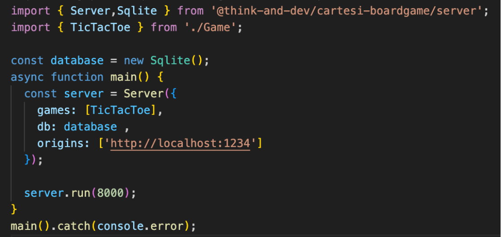

# Storage

## SQLite Integration with T&D’s Boardgame Framework

With this new functionality, we've added the option to use SQLite as a storage method for the framework, expanding the possibilities and catering to various storage needs.
Integrating SQLite3 as a storage method within T&D’s Boardgame Framework offers numerous advantages.

### Advantages of Using SQLite

- Data Persistence: SQLite allows for persistent storage of data.
- Ease of Use: SQLite is a lightweight database that does not require a separate server, simplifying its implementation and use in local environments.
- Portability: SQLite database files are highly portable, facilitating data transfer and backup for the game.
- Advanced Queries: SQLite supports complex query operations, enabling efficient handling and manipulation of large volumes of data.
- Compatibility and Flexibility: Adding SQLite as a storage option enhances the framework’s flexibility, allowing developers to choose between different persistence methods based on their specific needs.

### How to Implement SQLite3

#### Running with NONODO (the local Cartesi node for development and testing):

    - In Your Backend:
        - SQLite3 must be installed locally on your system, as NONODO will interact directly with this installation. Ensure that SQLite3 is available and properly configured; if not, you can run the command npm install sqlite3 on your system.

#### Running with CVM:

    - In Your Backend:
        - If you prefer to run the framework with CVM, simply use the preconfigured Dockerfile that includes SQLite3.
        - To run CVM, execute the command cartesi build and then cartesi run, ensuring that all necessary components are integrated.

    - Configuration Verification:
        - Verify that the Dockerfile is correctly configured to integrate SQLite3 and that your application can access the database without issues.

#### Incorporating SQLite into the Code:

    - In Your Backend:
        - The database to be used must be sent to the server (if no database is sent, the default database is the in-memory).

        

### Conclusion

This feature enhances the flexibility of game data storage by introducing SQLite as an additional storage option, complementing the existing methods like in-memory and flat file storage.
