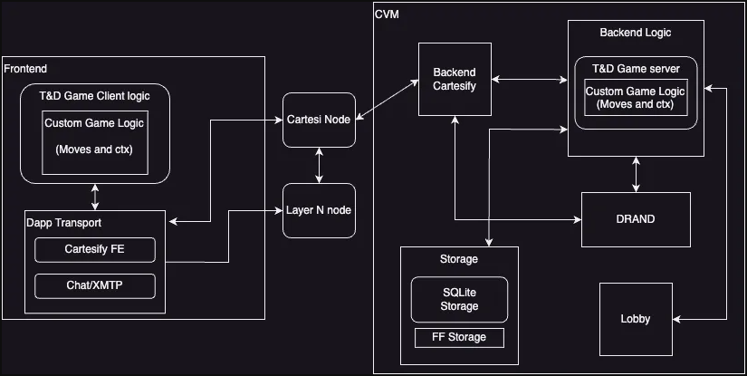

# Cartesi Integration

Cartesi plays a central role in enabling off-chain computations within the blockchain gaming framework, providing the infrastructure needed for efficient gameplay, secure communication, and reliable data management. The system is composed of several key components that work together to ensure seamless integration and functionality. Below is an overview of these core modules and their interactions, setting the stage for a deeper understanding of the Cartesi architecture.

1. **Game Client Logic**:

   The **Game Client Logic** controls the core game functionality on the client side. This includes managing the `G` (game state) and `ctx` (context) states provided by boardgame.io, which handle player actions, game phases, and turn logic. The client inherits all functionality from boardgame.io but leverages the custom **Dapp Transport** module for communication, ensuring seamless interaction with the backend and other players. This setup ensures that client-side logic remains lightweight while maintaining necessary connections for a decentralized gaming experience.

2. **Dapp Transport**:

   **DappTransport** serves as the custom transport layer responsible for communication within the decentralized environment. It integrates Cartesify’s frontend to facilitate interactions with the Cartesi Virtual Machine (CVM). This module enables secure and efficient messaging between the client and the backend, abstracting the complexity of blockchain-based communication. Additionally, **Dapp Transport** incorporates the **XMTP protocol** for player-to-player messaging, such as in-game chat, enhancing real-time interaction during gameplay. This ensures that both game logic and chat functionalities operate smoothly within the decentralized infrastructure.

3. **Backend Cartesify**:

   The **Backend Cartesify** module serves as the entry point for client data into the Cartesi system. It receives information from the frontend via the **Dapp Transport** and processes it within the **CVM**. Cartesify simplifies the interaction between the frontend and the CVM by transforming inputs and outputs into Web2-style REST API calls, making integration more accessible to developers familiar with traditional web development. This layer abstracts the complexity of blockchain communication, allowing the game logic to interact with the CVM as if it were communicating with a regular server, thus facilitating a smoother development process.

4. **Game Server**:

   The **Game Server** module manages the game logic and state replication on the server side. By maintaining a synchronized copy of the game state, it ensures that all players’ game sessions evolve correctly and consistently. Processing game actions on the server ensures fairness and prevents cheating, as the state is verifiable by all participants. The game server ensures resilience and consistency across multiple nodes, which is crucial in decentralized environments.

5. **Storage**:

   The storage system for the framework supports two main approaches. Initially, the **flat-file** storage method provided natively by boardgame.io will be used, where the game data is stored directly in a file. This approach is simple and effective for managing game states in a straightforward manner.

   In a second phase, a **SQLite adapter** will be implemented to offer a more robust storage solution, allowing for advanced data management and query capabilities. By the end of the development process, both storage strategies—flat-file and SQLite—will be fully available, providing flexibility to developers depending on their specific storage requirements.

6. **Lobby**:

   The **Lobby** manages player interactions before the game starts. It handles the creation, joining, and leaving of games, enabling players to organize matches efficiently. The lobby system is essential for the initial phase of the game and ensures a smooth onboarding experience. After the game begins, **XMTP** handles communication between players, with the lobby focusing primarily on match creation and organization.

7. **DRAND (Decentralized Randomness Beacon)**:

   For games that require random number generation, the **DRAND** module provides a reliable and decentralized source of randomness within the Cartesi environment. DRAND is integrated into the system to deliver secure, unbiased random values for game decisions (such as dice rolls or card shuffling). DRAND’s decentralized nature ensures trustworthiness and integrity, and the module is already available for easy integration into games needing such functionality.
