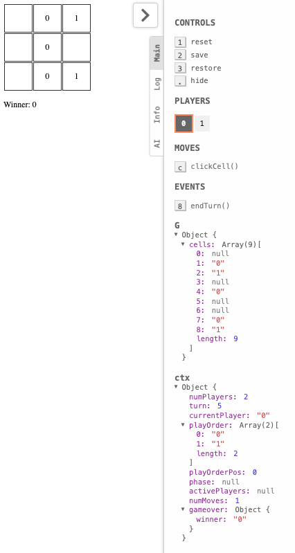

# Run a Pre-Built Example

To quickly get started with a pre-built example, such as the tic-tac-toe game, follow these steps to download the code from the Playground and run it on your local machine.

1. **Clone the Repository**: Start by cloning the repository that contains the example code. Open your terminal and run:

```
git clone https://github.com/Think-and-Dev/cartesi-boardgame
```

2. **Install Required Packages**: . In the root directory run:

- `npm i` to install dependencies.
- `yarn proxydirs` or `npm run proxydirs` to recognize multiplayer, internal, and other folders.
- `yarn build` or `npm run build` to compile the application.
- `yarn link` to obtain a link that will connect this repository with the backend and frontend.

Navigate to the examples ditectory and run the following commands:

```
cd typescript
yarn install
yarn link
cd ../backend
yarn install
yarn link
```

3. **Run Nonodo**: In a new terminal window, start Nonodo with verbose output to set up your local development environment and obtain a Private Key. Execute:

```
nonodo --anvil-verbose
```

Once you have configured your account in MetaMask using the obtained Private Key, you will only need to run nonodo without any additional flags for subsequent sessions.

4. **Start the Backend**: In another terminal window, navigate to the backend directory and start the backend server:

```
cd backend
yarn start
```

5. **Start the Frontend**: In yet another terminal window, navigate to the frontend directory and start the frontend application:

```
cd typescript
yarn start
```

The frontend should now be running at `http://localhost:1234`.

:::note
If you want to run the application **without using NONODO**, you must run the **CVM (Cartesi Virtual Machine)** with `cartesi build` and then `cartesi run`, it's not necessary to do `yarn start` in the backend or link the repositories. Simply running `yarn install` in the backend, then `cartesi build` and `cartesi run` will set up all the necessary structures.
:::

:::tip

### Connect to MetaMask

To interact with the application, you need to connect your MetaMask wallet:

- Open MetaMask and select "Localhost" as your network. If you do not see "Localhost" in the network list, you will need to add it manually:
  - Go to MetaMask and click on **Settings**.
  - Navigate to **Networks**.
  - Click on **Add Network** and fill in the following details:
    - **Network Name**: Localhost
    - **New RPC URL**: http://127.0.0.1:8545
    - **Chain ID**: 31337
    - **Currency Symbol**: ETH
- Create a new account using a Private Key. You can obtain valid Private Keys from the output of the previous command (`nonodo --anvil-verbose`).
- Additionally, configure MetaMask to allow customizing the nonce for each transaction. This step is crucial because when you restart Nonodo, it resets the blockchain state, but MetaMask does not recognize this reset. As a result, MetaMask expects a higher nonce than what is currently available in Nonodo, preventing you from making further transactions. To enable this:
  - Go to **Settings** in MetaMask.
  - Navigate to **Advanced**.
  - Enable **Customize transaction nonce**.
    :::

### How to Play

Once your application is running, follow these steps to start playing the tic-tac-toe game with two players:

1. **Open the Game**: Navigate to `http://localhost:1234` in your web browser. You will see a prompt that says "Enter player ID".

   

2. **Enter Player ID for Player 1**: In the input field, enter 0 and press Enter. This action will trigger MetaMask to open, prompting you to sign a transaction. Approve the transaction in MetaMask.
3. **Open a Second Tab**: Open a new tab in your browser and navigate again to `http://localhost:1234`. This time, enter 1 as the player ID and press Enter. MetaMask will open again for you to sign this second transaction. Approve the transaction in MetaMask.
4. **Playing the Game**: Now you have two tabs open, each representing a different player (Player 1 with ID 0 and Player 2 with ID 1). Each player can take turns selecting a square on the game board.
   - When it’s your turn, click on one of the squares to make your move. Each selection will generate a transaction that needs to be signed in MetaMask.
5. **Game End Conditions**: The game will continue until one of the players achieves tic-tac-toe (three in a row) or there are no more available moves left on the board. At that point, the game will end and the result will be shown in the screen.

   

### Troubleshooting

If you are experiencing issues connecting to the game, it may be due to problems with MetaMask. Here are some steps you can try to resolve these issues:

- Disable and Re-enable the MetaMask Extension: Sometimes, simply toggling the extension can resolve connectivity issues. Disable the MetaMask extension in your browser and then enable it again. Note that you will need to log in again after re-enabling.
- Check Nonce Values: Ensure that the nonce values suggested by MetaMask are consecutive. If there are pending transactions that have not been processed, it can prevent you from connecting to the game because MetaMask will be using a higher nonce than what is currently expected.
- Ensure No Pending Transactions: Make sure there are no pending transactions in your MetaMask wallet. Pending transactions can block new ones from being processed.
- Clear Activity Data: You can clear your activity data in MetaMask by going to Settings, then Advanced, and selecting Clear Activity Data. This action can help reset any stuck states in the extension.
